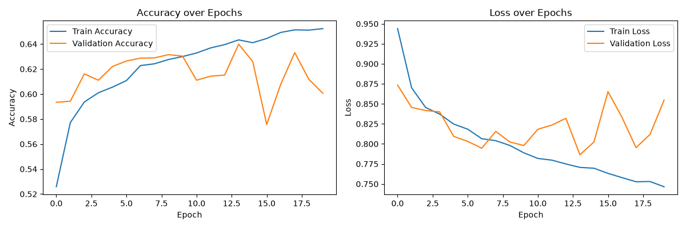

# Galaxy Morphology Classifier

A machine learning project to classify galaxies into morphological categories
(Smooth, Spiral, Irregular) using image data from the Galaxy Zoo 2 dataset.

## Motivation

Galaxy morphology — the shape and structure of a galaxy — gives astronomers clues
about its formation history and evolution. Galaxy Zoo crowd-sourced over 60,000
galaxy classifications from citizen scientists, asking a sequence of visual
questions about each galaxy. This project builds an image classifier that learns
to predict these morphological categories directly from galaxy images.

## Dataset

- **Source:** [Galaxy Zoo 2 — Kaggle "Galaxy Zoo: The Galaxy Challenge"](https://www.kaggle.com/c/galaxy-zoo-the-galaxy-challenge)
- **Size:** 61,578 labeled training images
- **Labels:** Each galaxy has vote fractions across 11 nested questions (a decision
  tree), reflecting how many volunteers chose each answer. See `notebooks/01_eda.ipynb`
  for the full decision tree reference and how vote fractions are computed.

## Labeling Approach (v1)

For this first version, the full 11-question tree is collapsed into 3 broad classes:

- **Smooth** — majority of volunteers classified it as smooth/round
- **Spiral** — majority classified it as having a spiral pattern
- **Irregular** — has visible features, but no clear spiral pattern

Galaxies majority-classified as stars/artifacts are discarded. Full reasoning for
this simplification is documented in `notebooks/01_eda.ipynb`.

A future version (v2) will use finer-grained classes (e.g., splitting "Smooth"
into round/in-between/cigar-shaped, and separating out edge-on disks).

## Class Distribution

| Class | Count |
|---|---|
| Smooth | 25,868 |
| Irregular | 25,269 |
| Spiral | 10,397 |

Spiral galaxies are notably underrepresented relative to the other two classes —
this imbalance will be addressed explicitly during model training (e.g., class
weighting).

## Baseline Model — Dense Neural Network

First model: a simple dense (fully-connected) network on flattened 64x64x3 images
(12,288 inputs). Two hidden layers (256 → 128 neurons) with dropout (0.3) for
regularization, softmax output for the 3 classes.

First training run (20 epochs, no early stopping) showed clear overfitting —
training accuracy kept climbing (52.6% → 65.2%) but validation accuracy
plateaued around epoch 9-10 (~63%) and got noisy/declined afterward. Makes
sense given the first dense layer alone has over 3 million parameters (since
flattening the image throws away spatial structure and connects every pixel to
every neuron) — a lot of capacity to just memorize the training set with.

Refit with early stopping (`patience=3`, monitoring validation loss,
restoring best weights) — training stopped at epoch 10, rolled back to the
best epoch (epoch 7).

**Final test accuracy: 63.5%** (vs. ~33% random-chance baseline for 3 classes).

This is the baseline number future models (CNN, transfer learning) will be
compared against. Full training curves and reasoning are in
`notebooks/03_baseline_dense_nn.ipynb`.

## CNN Model

Built a convolutional neural network to address the dense baseline's main
limitation — flattening images destroys spatial structure. Architecture: three
Conv2D + MaxPooling blocks (32 → 64 → 128 filters), followed by a Dense layer
(128 neurons) and softmax output. Also added data augmentation (random flips and
rotations), since galaxies have no fixed "correct" orientation in the sky.

Trained on Google Colab (GPU) due to CPU training time constraints — this
architecture would have taken an estimated 30+ minutes to over an hour per full
run on the local CPU-only machine, versus a few minutes on GPU.

Used the same early stopping setup as the baseline (`patience=3`, monitoring
validation loss, restoring best weights). Training stopped at epoch 11, with the
best validation performance at epoch 8.

**Final test accuracy: 72.7%** — a meaningful improvement over the dense
baseline's 63.5%. The train/validation gap was also much smaller than the dense
baseline's, suggesting the CNN generalizes better, likely due to both data
augmentation and the architecture's inherent fit to image data (weight sharing
via convolution, instead of treating every pixel as independent).

## Model Comparison

| Model | Test Accuracy |
|---|---|
| Dense NN baseline | 63.5% |
| CNN (with augmentation) | 72.7% |

Full training code and reasoning are in `notebooks/04_cnn.ipynb`.

## Project Structure

- `data/` — raw and processed data (gitignored)
- `notebooks/` — step-by-step development notebooks
- `src/` — reusable functions (data loading, preprocessing, models, evaluation)
- `models/` — saved trained model weights (gitignored)
- `reports/figures/` — exported plots and visualizations

## Approach

1. **Data preprocessing** — load images, resize to 64x64, normalize, encode labels,
   stratified train/val/test split *(done)*
2. **Baseline model** — dense neural network *(done)*
3. **CNN model** — convolutional architecture, trained on Google Colab (GPU) *(done)*
4. **Transfer learning** — fine-tuning a pretrained CNN backbone
5. **Class imbalance handling** — class weighting / focal loss
6. **Classical ML comparison** — Random Forest on hand-engineered features
7. **Interpretability** — Grad-CAM visualizations, confusion matrix, error analysis

## Setup

\`\`\`bash
python -m venv venv
venv\Scripts\activate          # Windows
pip install -r requirements.txt
\`\`\`

Dataset must be downloaded separately from Kaggle and placed in `data/raw/`
(see `notebooks/01_eda.ipynb` for expected folder structure).

## Status

🚧 Work in progress — CNN done (72.7% test accuracy, up from 63.5% dense
baseline), moving to transfer learning next.
