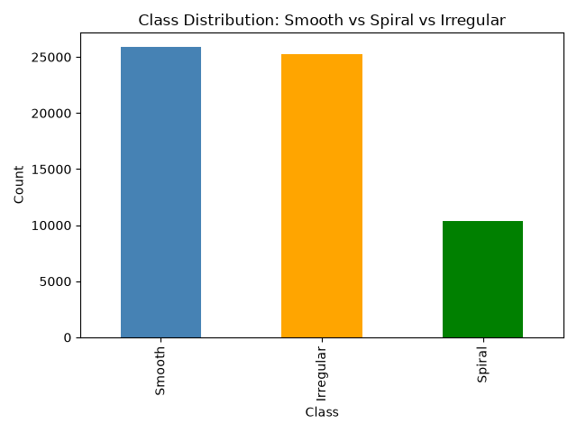
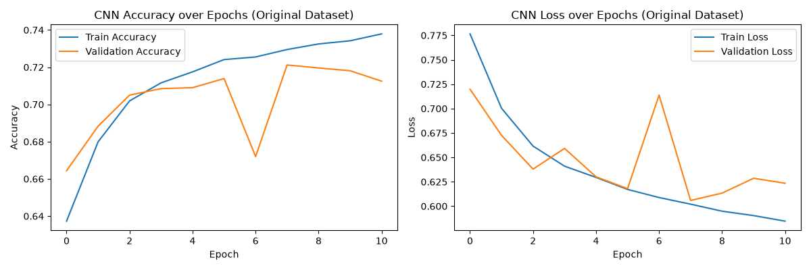
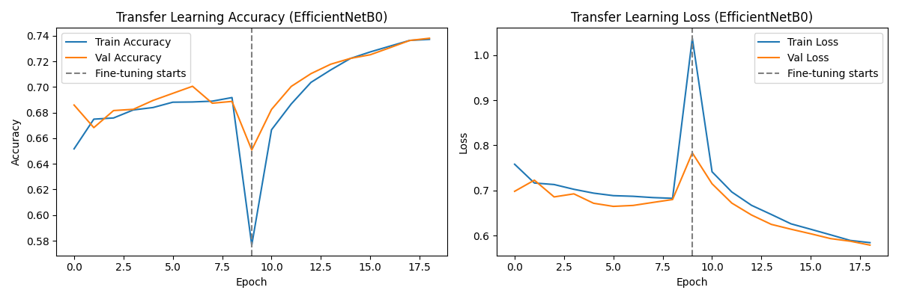
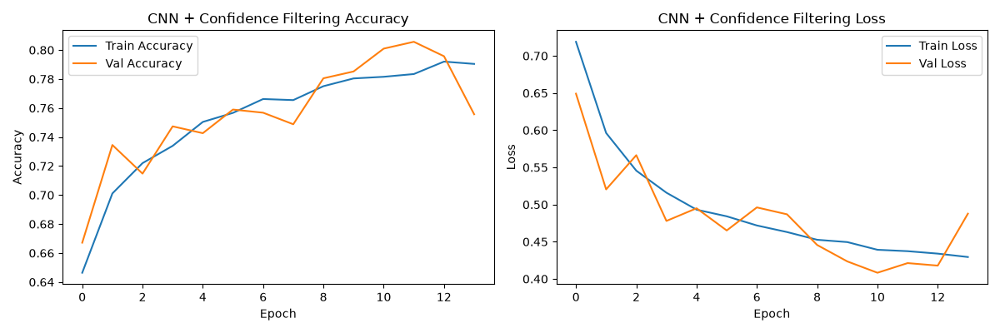
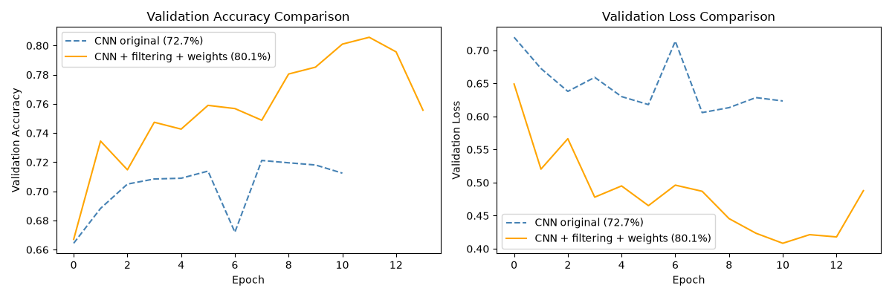

# Galaxy Morphology Classifier

A machine learning project to classify galaxies into morphological categories
(Smooth, Spiral, Irregular) using image data from the Galaxy Zoo 2 dataset.
Built as a portfolio project while completing Andrew Ng's Machine Learning
Specialization (Course 2: Advanced Learning Algorithms).

## Motivation

Galaxy morphology — the shape and structure of a galaxy — gives astronomers
clues about its formation history and evolution. Galaxy Zoo crowd-sourced over
60,000 galaxy classifications from citizen scientists, asking a sequence of
visual questions about each galaxy image. This project builds image classifiers
that learn to predict these morphological categories directly from galaxy images,
progressing from a simple dense network baseline to a fine-tuned CNN with
careful data quality handling.

## Dataset

- **Source:** [Galaxy Zoo 2 — Kaggle "Galaxy Zoo: The Galaxy Challenge"](https://www.kaggle.com/c/galaxy-zoo-the-galaxy-challenge)
- **Size:** 61,578 labeled training images (424×424 original resolution)
- **Labels:** Each galaxy has vote fractions across 11 nested questions (a
  decision tree), reflecting how many volunteers chose each answer. See
  `notebooks/01_eda.ipynb` for the full decision tree reference and how
  vote fractions are computed.

## Labeling Approach

Galaxy Zoo's labels are vote fractions, not clean categories — a value of 0.85
in Class1.1 means 85% of volunteers said the galaxy looked smooth. Two labeling
schemes were used in this project:

**v1 — Majority threshold (0.5):** Used for initial baseline models.
- Class1.1 >= 0.5 → Smooth
- Class4.1 >= 0.5 → Spiral
- Otherwise → Irregular
- Discard: Class1.3 >= 0.5 (stars/artifacts)
- Result: 61,534 labeled galaxies

**v2 — Confidence filtering (0.7):** Used for best-performing models.
- Only galaxies where >= 70% of volunteers agreed are kept
- ~40% of the dataset dropped as genuinely ambiguous
- Result: 36,812 high-confidence galaxies

Full reasoning documented in `notebooks/01_eda.ipynb` and
`notebooks/02_preprocessing.ipynb`.

## Class Distribution

### v1 (majority threshold)

| Class | Count |
|---|---|
| Smooth | 25,868 |
| Irregular | 25,269 |
| Spiral | 10,397 |

### v2 (confidence filtered)

| Class | Count |
|---|---|
| Irregular | 16,153 |
| Smooth | 14,146 |
| Spiral | 6,513 |



Spiral galaxies are notably underrepresented in both versions — addressed via
class weighting in the loss function during training.

## Model Results

### Dense NN Baseline

First model: a simple dense (fully-connected) network on flattened 64×64×3
images (12,288 inputs). Two hidden layers (256 → 128 neurons) with dropout
(0.3) and softmax output.

First run showed clear overfitting — training accuracy kept climbing but
validation accuracy plateaued then declined. Refit with early stopping
(patience=3, restoring best weights).

**Test accuracy: 63.5%**

Full training curves and reasoning in `notebooks/03_baseline_dense_nn.ipynb`.

---

### CNN (from scratch)

Three Conv2D + MaxPooling blocks (32 → 64 → 128 filters), Dense 128 head,
dropout 0.3, softmax output. Data augmentation added (random flips and
rotations) since galaxies have no fixed orientation in the sky. Trained on
Google Colab T4 GPU.

The CNN addressed the dense baseline's main limitation: flattening images
destroys spatial structure. CNNs use weight-shared filters that slide across
the image, preserving spatial relationships and using far fewer parameters
(1.14M vs 3.18M) despite being a deeper architecture.

**Test accuracy: 72.7%** (+9.2 points over dense baseline)



Full code in `notebooks/04_cnn.ipynb`.

---

### Transfer Learning — EfficientNetB0

Pretrained EfficientNetB0 backbone (ImageNet weights, frozen initially) with
a custom classification head. Two-phase training:
- Phase 1: train head only (backbone frozen, lr=1e-3) → ~70% val accuracy
- Phase 2: fine-tune full model (backbone unfrozen, lr=1e-5) → 73.8% test accuracy

Used a tf.data pipeline instead of numpy arrays — loading 61k images at
224×224 as numpy arrays requires ~37GB RAM (Colab has ~12GB). tf.data loads
one batch at a time, keeping memory usage constant.

**Test accuracy: 73.8%** (+1.1 points over CNN baseline)

The modest gain over the CNN baseline pointed to label noise and class
imbalance as the real bottleneck — not architecture.



Full code in `notebooks/05_transfer_learning.ipynb`.

---

### CNN + Confidence Filtering + Class Weighting

Same CNN architecture as before — but trained on the v2 confident dataset
(36,812 images, 0.7 threshold) with class weighting to address Spiral
underrepresentation.

Key finding: a simpler CNN on clean labels (80.1%) outperformed a pretrained
EfficientNetB0 on noisy labels (73.8%). Label quality mattered more than
model complexity — roughly 40% of the original dataset was adding noise
rather than signal.

**Test accuracy: 80.1%** (+7.4 points over original CNN, best result so far)



Full code in `notebooks/04_cnn.ipynb` (Part 2).

---

## Full Model Comparison

| Model | Dataset | Test Accuracy |
|---|---|---|
| Dense NN baseline | Original (61k, 0.5 threshold) | 63.5% |
| CNN from scratch | Original (61k, 0.5 threshold) | 72.7% |
| EfficientNetB0 transfer learning | Original (61k, 0.5 threshold) | 73.8% |
| CNN + confidence filtering + class weighting | Confident (36k, 0.7 threshold) | **80.1%** |



## Project Structure

- `data/` — raw and processed data (gitignored)
- `notebooks/` — step-by-step development notebooks (numbered in order)
- `src/` — reusable functions (data loading, preprocessing, models, evaluation)
- `models/` — saved trained model weights (gitignored)
- `reports/figures/` — exported plots and visualizations

## Notebooks

| Notebook | Description |
|---|---|
| `01_eda.ipynb` | EDA, decision tree schema, class distribution |
| `02_preprocessing.ipynb` | Image loading, normalization, splits (v1 + v2) |
| `03_baseline_dense_nn.ipynb` | Dense NN baseline, overfitting diagnosis, early stopping |
| `04_cnn.ipynb` | CNN from scratch + confidence filtering + class weighting |
| `05_transfer_learning.ipynb` | EfficientNetB0 two-phase fine-tuning, tf.data pipeline |

## Setup

```bash
python -m venv venv
venv\Scripts\activate          # Windows
pip install -r requirements.txt
```

Dataset must be downloaded separately from Kaggle and placed in `data/raw/`
(see `notebooks/01_eda.ipynb` for expected folder structure). CNN and transfer
learning models were trained on Google Colab T4 GPU — local CPU training is
feasible only for the dense baseline and preprocessing steps.

## Status

🚧 Work in progress — best result so far: 80.1% test accuracy (CNN +
confidence filtering + class weighting). Next steps: EfficientNetB3 on
confident dataset, Test Time Augmentation (TTA).